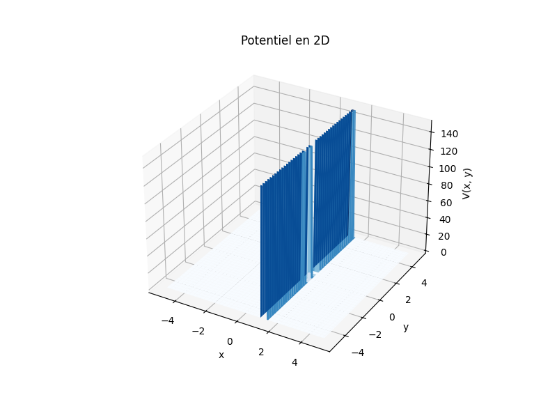
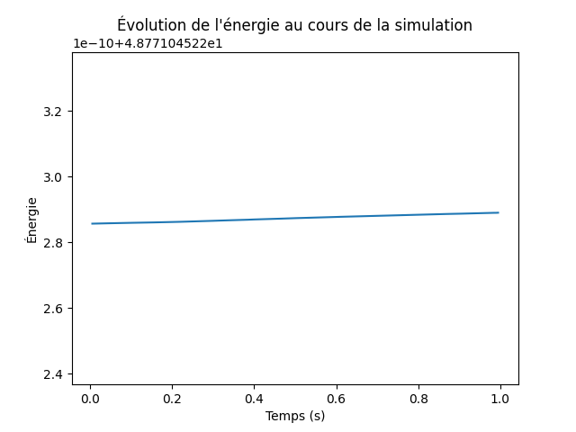
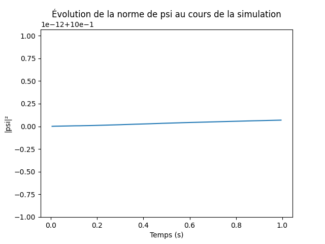

# Schrödinger Equation - Quantum Simulations  

This repository contains numerical simulations of quantum mechanical phenomena using **Python**. The simulations solve the **time-dependent Schrödinger equation (TDSE)** for various potential configurations using **finite difference methods** and the **Crank-Nicolson algorithm** for stability.  

The project serves as an **introduction to Partial Differential Equations (PDEs)** in quantum physics, covering key examples such as the **heat equation, harmonic oscillator, quantum tunneling, and Young's double-slit experiment**.  

---  

## 📌 **Project Overview**  

### 1️⃣ **Introduction: Heat Equation (PDE basics)**  
- Implements the **heat diffusion equation** to introduce numerical PDE solvers (Euler).  
- Uses **finite difference methods** for time evolution.  
- **Visualization:** [heat-diffusion.mp4](heat-diffusion/results/heat-diffusion.mp4)  
- **Code:** [heat-diffusion.py](heat-diffusion/heat-diffusion.py)  

### 2️⃣ **Quantum Harmonic Oscillator**  
- Solves the Schrödinger equation for a **harmonic potential** \( V(x) = \frac{1}{2} m \omega^2 x^2 \).  
- Demonstrates **wavefunction evolution over time**.  
- Uses **Crank-Nicolson for stability**.  
- **Visualizations:**  
  - 1D Oscillator: [harmonic-oscillator.mp4](harmonic-oscillator/results/harmonic-oscillator.mp4)  
  - 2D Oscillator: [harmonic-oscillator-2D.mp4](harmonic-oscillator/results/harmonic-oscillator-2D.mp4)  
- **Code:** [harmonic-oscillator.py](harmonic-oscillator/harmonic-oscillator.py)  

### 3️⃣ **Quantum Tunneling Effect**  
- Simulates a **wave packet propagating through a potential barrier**.  
- Demonstrates **quantum mechanical barrier penetration**.  
- **Visualization:** [tunneling-effect.mp4](tunneling-effect/results/tunneling-effect.mp4)  
- **Code:** [tunnelling-effect.py](tunneling-effect/tunnelling-effect.py)  

### 4️⃣ **Young’s Double-Slit Experiment (Quantum Interference)**  
- Simulates **wave interference in a 2D potential**.  
- Models the **probability density** behind two slits.  
- Explores **quantum superposition and wave-particle duality**.  
- **Results:**  
  - Theoretical result:   
  - Simulated screens:  |  |   
- **Visualization:** [young_s-interference.mp4](Young_s-interference/results/young_s-interference.mp4)  
- **Code:**  
  - Theoretical prediction: [Young-theorical-result.py](Young_s-interference/Young-theorical-result.py)  
  - Simulation: [Young_s-interference.py](Young_s-interference/Young_s-interference.py)  
- Potential visualization:   

---

## 📊 **Numerical Stability & Energy Conservation**  
The simulations rely on the **Crank-Nicolson method**, ensuring numerical stability. To verify this, we track **energy and norm conservation** in the absence of absorbing boundaries:  

- **Energy Conservation:**   
- **Norm Conservation:**   

---

## 📄 **Project Report**  
A full report on the **2D Young’s Double-Slit Experiment simulation** is available:  
📄 **[Rapport-Simulation_numérique_Fentes_de_Young_en_2D.pdf](Rapport-Simulation_numérique_Fentes_de_Young_en_2D.pdf)**  

---

## 🛠 **Installation & Dependencies**  
This project requires Python **3.7+** and the following libraries:  
```bash
pip install numpy matplotlib scipy
```
---

## 🚀 Usage  
To run a simulation, simply execute the corresponding script with Python:  

```bash
python Young_s-interference/Young_s-interference.py
```
or  
```bash
python tunneling-effect/tunnelling-effect.py
```
or  
```bash
python harmonic-oscillator/harmonic-oscillator.py
```
This will generate and display the associated animation.

If you want to modify the simulation parameters (grid size, initial conditions, potential...), they are defined at the beginning of each Python script and can be adjusted as needed.

---

## 🛠 Project Structure  

```
📂 schrodinger-simulations/
│
├── 📄 Rapport-Simulation_numérique_Fentes_de_Young_en_2D.pdf (Detailed report on the Young's double-slit experiment simulation)
│
├── 📂 heat-diffusion/
│   ├── heat-diffusion.py
│   └── results/
│       └── heat-diffusion.mp4
│
├── 📂 harmonic-oscillator/
│   ├── harmonic-oscillator.py
│   └── results/
│       ├── harmonic-oscillator.mp4
│       └── harmonic-oscillator-2D.mp4
│
├── 📂 tunneling-effect/
│   ├── tunnelling-effect.py
│   └── results/
│       └── tunneling-effect.mp4
│
├── 📂 Young_s-interference/
│   ├── Young_s-interference.py
│   ├── Young-theorical-result.py 
│   └── results/
│       ├── young_s-interference.mp4
│       ├── method/
│       │   ├── potentiel_fentes-de-Young.png
│       │   ├── stabilte-de-l_energie-Crank-Nicholson.png
│       │   └── stabilte-de-la-norme-Crank-Nicholson.png
│       └── screen/
│           ├── Young-theorical-result.png
│           ├── Young_ecran1.png
│           ├── Young_ecran2.png
│           └── Young_ecran3.png
│
└── 📜 README.md (This file)
```

---

## 🤝 Contributions & Contact  
Contributions are welcome! You can:

- Fork the project and suggest improvements.
- Submit a pull request if you add features or fix a bug.
- Open an issue to ask a question or report a problem.

💡 Contact: Feel free to reach out if you have any suggestions or questions about the simulations!

## 🚀 Happy quantum explorations!
