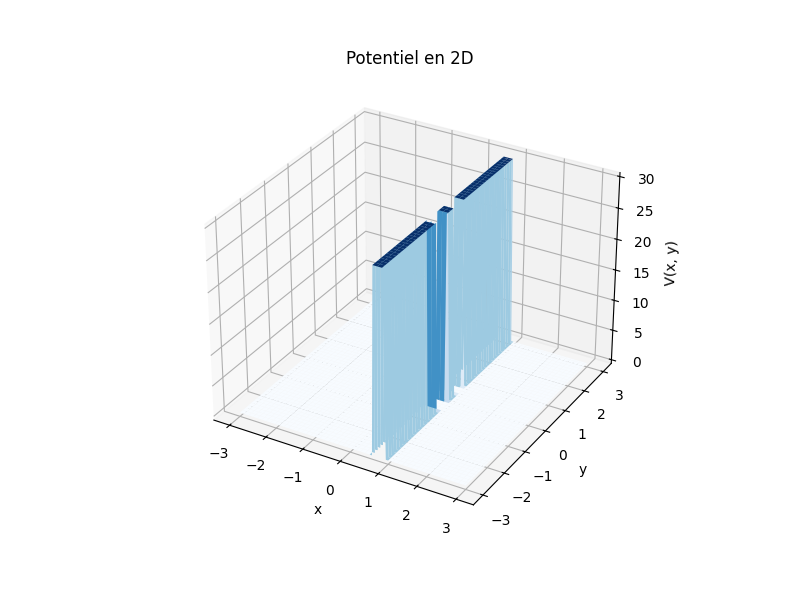

# Schrödinger Equation - Quantum Simulations  

This repository contains numerical simulations of quantum mechanical phenomena using **Python**. The simulations solve the **time-dependent Schrödinger equation (TDSE)** for various potential configurations using **finite difference methods** and the **Crank-Nicolson algorithm** for stability.  

The project serves as an **introduction to Partial Differential Equations (PDEs)** in quantum physics, covering key examples such as the **heat equation, harmonic oscillator, quantum tunneling, and Young's double-slit experiment**.  

---  

## 📌 **Project Overview**  

### 1️⃣ **Introduction: Heat Equation (PDE basics)**  
- Implements the **heat diffusion equation** to introduce numerical PDE solvers.  
- Uses **finite difference methods** for time evolution.  
- **Visualization:** [heat-diffusion.mp4](heat-diffusion.mp4)  
- **Code:** [heat-diffusion.py](heat-diffusion.py)  

### 2️⃣ **Quantum Harmonic Oscillator**  
- Solves the Schrödinger equation for a **harmonic potential** \( V(x) = \frac{1}{2} m \omega^2 x^2 \).  
- Demonstrates **wavefunction evolution over time**.  
- Uses **Crank-Nicolson for stability**.  
- **Visualizations:**  
  - 1D Oscillator: [harmonic-oscillator.mp4](harmonic-oscillator.mp4)  
  - 2D Oscillator: [harmonic-oscillator-2D.mp4](harmonic-oscillator-2D.mp4)  
- **Code:** [harmonic-oscillator.py](harmonic-oscillator.py)  

### 3️⃣ **Quantum Tunneling Effect**  
- Simulates a **wave packet propagating through a potential barrier**.  
- Demonstrates **quantum mechanical barrier penetration**.  
- **Visualization:** [tunneling-effect.mp4](tunneling-effect.mp4)  
- **Code:** [tunnelling-effect.py](tunnelling-effect.py)  

### 4️⃣ **Young’s Double-Slit Experiment (Quantum Interference)**  
- Simulates **wave interference in a 2D potential**.  
- Models the **probability density** behind two slits.  
- Explores **quantum superposition and wave-particle duality**.  
- **Results:**  
  - Theoretical result:   
  - Simulated screens:  |  |   
- **Visualization:** [young_s-interference.mp4](young_s-interference.mp4)  
- **Code:**  
  - Theoretical prediction: [Young-theorical-result.py](Young-theorical-result.py)  
  - Simulation: [Young_s-interference.py](Young_s-interference.py)  
  - Potential visualization:   

---

## 📊 **Numerical Stability & Energy Conservation**  
The simulations rely on the **Crank-Nicolson method**, ensuring numerical stability. To verify this, we track **energy and norm conservation** in the absence of absorbing boundaries:  

- **Energy Conservation:**   
- **Norm Conservation:**   

---

## 📄 **Project Report**  
A full report on the **2D Young’s Double-Slit Experiment simulation** is available:  
📄 **[Rapport-Simulation_numérique_Fentes_de_Young_en_2D.pdf](Rapport-Simulation_numérique_Fentes_de_Young_en_2D.pdf)**  

---

## 🛠 **Installation & Dependencies**  
This project requires Python **3.7+** and the following libraries:  
```bash
pip install numpy matplotlib scipy
